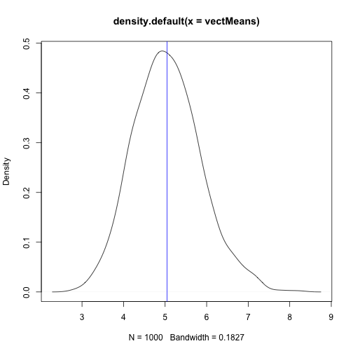
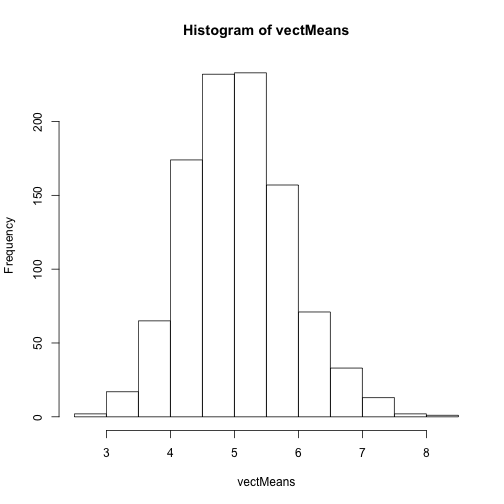

Exponential distribution Simulation 
========================================================

This is the first part of the project for the Statistical inference course.
The exponential distribution was simulated with the function rexp(n,lambda), using lambda = 0.2

### 0. The simulation
First run thousand times the simulated data for n=40, lambda=0.2 and stored the mean of each sample in a vector


```r

lambda = 0.2
n = 40
times = 1000

vectMeans <- NULL
vectVar <- NULL
vectStDev <- NULL

samples <- replicate(times, rexp(n, lambda))

for (i in 1:times) {
    vectMeans <- c(vectMeans, mean(samples[, i]))
    vectVar <- c(vectVar, var(samples[, i]))
    vectStDev <- c(vectStDev, sd(samples[, i]))
}
```


### 1. Where the distribution is centered at and compare it to the theoretical center of the distribution


```r
theMean <- mean(vectMeans)
theDensity <- density(vectMeans)
plot(theDensity)
```

 

The mean of the simulated data was 5.0054 , which is very close to the theoretical center of the distribution: 1/0.2=5

### 2.  How variable it is and compare it to the theoretical variance of the distribution
The theoretical variance for the exponential distribution is 1/(lambda*lambda), in this case: 1/(0.2 * 0.2)=25


```r

variance <- mean(vectVar)
```

The variance for the simulated data is 25.1069,  again very close to the theoretical value.
### 3. Show that the distribution is approximaterly normal
The next graph is a qqplot that evaluates the fit of the sample data with a normal distribution. It uses the theoretical quantiles of the distribution

```r

hist(vectMeans)
```

 

As seen in the histogram above, the data seems to follow a  normal distribution.


### 4.  Evaluate the coverage of the confidence interval


```r
coverage <- array(0, 1000)
cs <- array(0, 100)
for (k in 1:1000) {
    oneSample <- samples[, k]
    MaxiSample <- max(oneSample)
    MiniSample <- min(oneSample)
    C = (MaxiSample - MiniSample)/(2 * sqrt(n))
    
    cinterval <- ((vectMeans[k] - C < 1) & (vectMeans[k] + C > 1))
    
    coverage[k] <- mean(cinterval)
}

```

